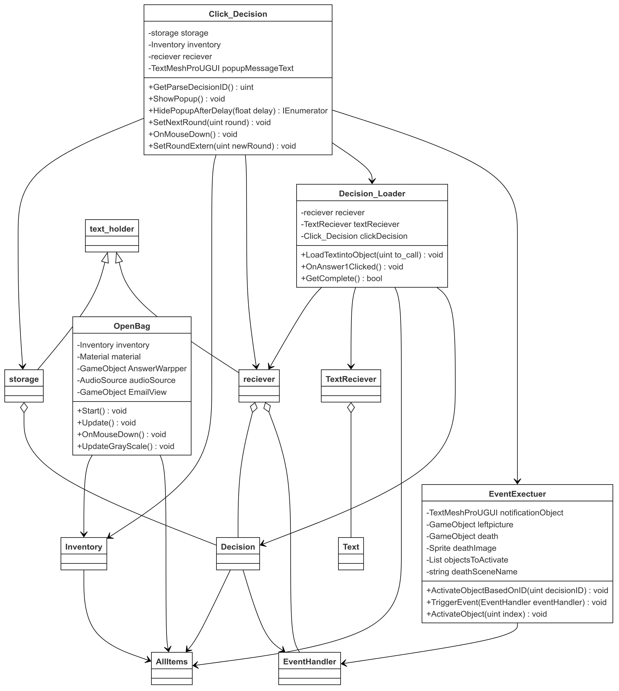
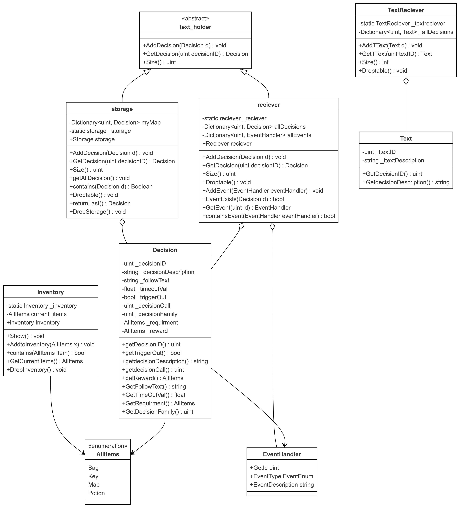
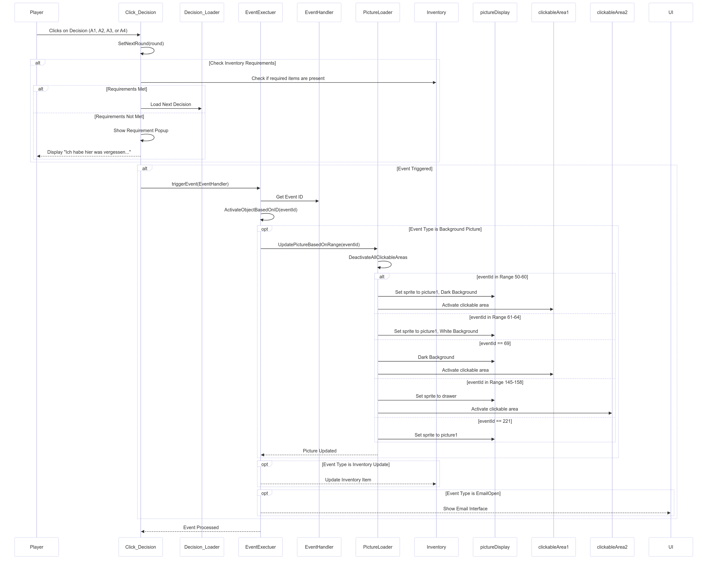

# Annie's Escape 


We are a group of 3 students who worked together during our internship to design and develop a game in Unity.

---

## Team Members

- **Katharina Zorko**
- **Tobias Sieber**
- **Sascha Sieber**

We collaborated over a span of several months to create this game, learning new skills, solving problems, and improving our understanding of game development and Unity.

---

## Game Overview

Annie's Escape is a text based story game where the player is responsible for saving Annie. 
This must be done by giving Annie the correct information, this being said, reading and understanding the story is important.
.
Our team strived to make this game accessible for everyone,thus everyone,even without heavy knowledge of video games could and have fun with our creation.


## Installation and Setup

To get started with our game, follow these simple steps to install and set up:

### Prerequisites
- Unity (version 6 or later)


### Setup Steps
1. **Download the repository**:
   Clone the repository or download it as a ZIP file.

   ```bash
   git clone https://github.com/Flowy1337/Annies-Escape.git
   

### Diagrams
1. **This UML diagram shows  the entire structure of our for making decisions.**


2. **The same strucutre in more detail without the Unity objects.**


3. **Sequenz diagram for making decisions.**



**_NOTE:_**  All diagrams can be seen in the Game Development Document (GDD)
